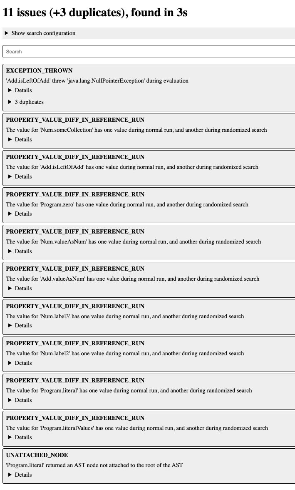

This is a tiny compiler with several intentional implementation issues that can be found by Tragdor.

# Building

Build `compiler.jar` using the script `build.sh`, like this:

```bash
cd example-compiler
sh build.sh
```

# Running

## As a stand-alone compiler

The compiler creates a hard-coded AST, and therefore takes no input.
Run the compiler to print values from the AST:

```bash
cd example-compiler
java -jar compiler.jar
```

## Finding issues in Tragdor

A search configuration for this language is available in `configs`.
Run Tragdor with it as follows:

```bash
java -jar tragdor.jar generate configs/example.json
```

This command uses the algorithm `Random Order` to find issues. Then use the `serve` mode of Tragdor to look at the results (available at http://localhost:8000/):

```bash
java -jar tragdor.jar serve reports.json
```

The result is expected to look as the following (the order might differ):



For instance, the attribute `Num.label2` computes unique labels in the wrong way as shown in Listing 2 in the paper.

# Code Structure

The compiler has three source files; `Compiler.java`, `addnum.ast` and `attributes.jrag`.
All implementation issues are found in `attributes.jrag`.
It contains several `aspect` declarations.
Notably, there are 5 aspects named "IssueType_X", where "X" is a type of implementation issue that may be present in an attribute grammar specification.
Each one of these additionally contain a comment `// <-- Error` that points out to the specific location of the implementation issue.

# Generating and running tests

Tragdor can generate JUnit test cases for some of the symptoms it finds.
To do this, supply the optional system property `tragdor.test.dst` when running `explain`.
For example, you can run:

```bash
java -Dtragdor.test.dst=testgen -jar tragdor.jar explain reports.json
```

You can then run the generated test cases:

```bash
sh run_generated_tests.sh
```

Similar to expected number of symptoms, the expected number of generated tests depend on the search algorithm.
`user_order` is expected to find zero tests, and all others should find ~3-7 tests.


# Customizing the search algorithm

One of the more important features of Tragdor is its search algorithms.
You can manually set the algorithm using the system property `tragdor.cfg.search_algorithm`.
For example, to use the `Random Equation Check` algorithm, run:

```bash
java -Dtragdor.cfg.search_algorithm=rec -jar tragdor.jar generate configs/example.json
```
The possible values for the search algorithm are:

- `random_order` (Random Order)
- `rido` (Random Inverse Dependency Order)
- `rec` (Random Equation Check)
- `user_order` (User Order)

The choice of search algorithm has an impact on which issues can be found:

* `random_order` and `rido` can find everything.
* `rec` can detect everything except `Set Order` and `HOA Theft`.
* `user_order` can only detect `Set Order` and `Exception`.

Consequently, the expected number of found symptoms is different for each algorithm:

| Algorithm    | Num Symptoms |
|--------------|--------------|
| random_order | 11           |
| rido         | 11           |
| rec          | 8            |
| user_order   | 2            |

